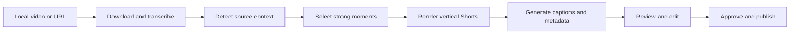

# YouTube Clipper

[](https://github.com/rajwinder-mankoo/Youtube-Clipper/actions/workflows/ci.yml)
[](https://www.python.org/)
[](#requirements)

Turn long-form videos into vertical YouTube Shorts, review the generated
metadata, and publish from a private local dashboard.

YouTube Clipper combines transcription, source detection, moment selection,
vertical rendering, captions, metadata generation, upload planning, and
multi-account publishing in one self-hosted workflow.

> [!IMPORTANT]
> Process and publish only content that you own or are authorized to use. This
> project does not bypass copyright restrictions or platform policies.

## Highlights

- Downloads supported sources with `yt-dlp` or processes local video files.
- Transcribes complete sources with Faster-Whisper and reuses cached results.
- Selects coherent moments instead of cutting at fixed intervals.
- Keeps every generated or edited Short below one minute (59 seconds maximum).
- Trims clips while keeping captions, manifests, and editing copies aligned.
- Edits caption typography, colors, outline, shadow, position, and safe-area margin.
- Renders 1080 x 1920 video with synchronized SRT captions.
- Generates source-aware titles, descriptions, and tags.
- Keeps metadata isolated between sources and clips.
- Connects YouTube accounts with separate tokens and upload logs.
- Summarizes views, watch time, and audience retention with editing feedback.
- Prevents duplicate uploads and supports private, public, and scheduled modes.
- Provides a review-and-approve step before any dashboard upload.
- Offers a true dry run that does not open OAuth or call the YouTube API.

## How it works



The review step stores the exact planned YouTube request. The uploader refuses
to continue if the payload changes after approval.

## Requirements

- Python 3.10 or newer
- FFmpeg and FFprobe on `PATH`
- Deno for current `yt-dlp` YouTube JavaScript handling
- Tesseract OCR, recommended for improved source detection
- Google/YouTube OAuth desktop credentials for publishing
- Enough free storage for source video, render cache, and generated Shorts

The default Faster-Whisper configuration uses CPU with `int8` compute and the
`small` model. A GPU is not required.

## Quick start

### 1. Clone the repository

```bash
git clone https://github.com/rajwinder-mankoo/Youtube-Clipper.git
cd Youtube-Clipper
```

### 2. Set up and start

Windows PowerShell:

```powershell
python scripts\start.py
```

Linux/macOS:

```bash
python3 scripts/start.py
```

The starter creates `.venv` when needed, installs the Python dependencies,
creates runtime directories, restores the example account configuration, runs
a readiness check, and starts the dashboard with the correct Python
interpreter. Re-running it is safe. It never creates OAuth credentials or
tokens.

If `venv` support is missing on Ubuntu, install `python3-venv` first. FFmpeg,
FFprobe, Deno, and Tesseract must be installed through your operating system.
The readiness report identifies anything that is still missing before you try
to generate a Short.

Open <http://127.0.0.1:8765> after the dashboard starts.

### 3. Optional: configure publishing

The repository includes safe defaults in:

- `config/settings.json`
- `config/accounts.json`
- `config/accounts.example.json`

Edit `config/accounts.json` to define publishing destinations. To restore the
safe example:

```bash
cp config/accounts.example.json config/accounts.json
```

On Windows PowerShell:

```powershell
Copy-Item config\accounts.example.json config\accounts.json
```

Place the Google OAuth desktop application file at:

```text
client_secret.json
```

OAuth secrets, tokens, generated media, caches, and logs are excluded by
`.gitignore`.

Dashboard account connection and analytics require a separate Google OAuth
**Web application** credential saved as `oauth_web_client.json`. Enable the
YouTube Data API and YouTube Analytics API, then register the exact callback
shown on the Accounts page, for example:

```text
https://youtube-clipper.example.ts.net/oauth/youtube/callback
```

For a dashboard opened directly on the same computer, the callback is instead:

```text
http://127.0.0.1:8765/oauth/youtube/callback
```

Use the exact address displayed in that installation's Accounts page. Each
clone keeps its own ignored `oauth_web_client.json` and OAuth token; cloning the
repository does not copy either secret.

The dashboard safely enables OAuthLib's HTTP exception only while processing a
validated localhost OAuth request. Do not set `OAUTHLIB_INSECURE_TRANSPORT`
globally; Tailscale and other remote dashboard addresses still require HTTPS.

The existing `client_secret.json` desktop credential can continue serving
command-line authorization. Existing upload tokens remain usable, but must be
reconnected once before the Analytics page can read retention data.

### 4. Later launches and diagnostics

Use the same one-command starter for normal launches:

```powershell
python scripts\start.py
```

To inspect the installation without starting the dashboard:

```powershell
.\.venv\Scripts\python.exe scripts\doctor.py
```

On Linux/macOS, use `.venv/bin/python scripts/doctor.py`.

If setup is interrupted, run `python scripts/bootstrap.py` again. Always start
the application through `scripts/start.py` or the `.venv` Python shown by the
setup helper; using an unrelated system Python is the most common cause of
missing-package errors.

## Dashboard workflow

See the [dashboard guide](docs/DASHBOARD.md) for account setup and operational
details.

1. Choose a YouTube account.
2. Generate Shorts from a supported YouTube URL, or place a local source in
   `input/` and run the command-line workflow.
3. Preview each rendered Short. New renders include an **Adjust frame** control:
   seek to a point in the retained full-frame clip, position the 9:16 crop,
   and release to keep a crop point. Add more points when the subject moves left, center,
   or right; the renderer moves and zooms smoothly between them. Use Play preview and Undo to refine the movement, then choose Save crop.
   Automatic tracking is replaced only when you save the manual crop.
4. Select one or more rendered Shorts.
5. Choose **Prepare upload**.
6. Review the video, title, description, tags, validation result, visibility,
   and planned publishing action.
7. Choose **Approve and upload** only when the request is correct.

Preparing a review does not use YouTube OAuth and does not make YouTube API
calls.

The framing editor is available for newly generated Shorts. Each one retains a
full-frame H.264 editing master next to the upload-ready 9:16 file, so manual
keyframes never crop an already-cropped render. Saved timelines can be reopened
and revised. These masters use additional disk space and are removed with the
Short when **Delete Shorts** is used.

## Command-line usage

Process a local source:

```bash
python run_all.py local
```

Process a YouTube URL:

```bash
python run_all.py "https://www.youtube.com/watch?v=VIDEO_ID"
```

Preview the full workflow without OAuth or API calls:

```bash
python run_all.py local --dry-run
python run_all.py "https://www.youtube.com/watch?v=VIDEO_ID" --dry-run
```

Dry-run reports are written to `output/dry-run-reports/`. Each report includes
validation results, planned order and scheduling, caption information, and the
exact `videos.insert` request body.

Command-line uploads ask for confirmation by default. Set
`YT_AUTO_BOT_AUTO_UPLOAD=1` only for a deliberately unattended run.

## Publishing modes

Set `privacy_status` in `config/settings.json`:

| Mode | Behavior |
|---|---|
| `private` | Every uploaded Short remains private. |
| `public` | Every approved Short is published immediately. |
| `scheduled` | The newest pending Short can publish immediately; remaining Shorts use future slots. |

The default scheduling interval is 12 hours. Offline dry-run schedule times are
estimates based on the local upload log because a dry run never queries the
channel.

## Project layout

```text
Youtube-Clipper/
|-- youtube_clipper/       Application package
|   |-- backend/           Dashboard server and background jobs
|   |-- metadata/          Source detection and SEO generation
|   |-- publishing/        Upload policy, payloads, and YouTube client
|   |-- video/             Framing and video-editing helpers
|   |-- cli.py             Command-line workflow orchestration
|   |-- config.py          Paths, settings, and logging
|   `-- pipeline.py        Download, transcription, selection, and rendering
|-- dashboard/             Browser interface assets
|-- config/                User-editable account and application settings
|-- scripts/               Setup and validation helpers
|-- tests/                 Regression checks
|-- docs/                  Operations and architecture documentation
|-- dashboard.py           Stable dashboard entry point
|-- main.py                Stable generation entry point
|-- run_all.py             Stable workflow entry point
`-- youtube_automator.py   Stable publishing entry point
```

The small root entry files preserve existing commands and the Proxmox systemd
configuration. Application implementations live in `youtube_clipper/`; see
[Architecture](docs/ARCHITECTURE.md) for ownership and dependency boundaries.

Runtime directories such as `input/`, `output/`, `cache/`, and `logs/` are
created locally and are not committed.

## Testing

Run all available checks:

```bash
python scripts/check.py
```

This compiles Python, runs the regression and unit suites, and validates the
dashboard JavaScript when Node.js is available. Individual checks can also be
run directly:

```bash
python -m tests.test_isolation
python -m unittest tests.test_publishing_safety
python -m unittest tests.test_storage_cleanup tests.test_captions tests.test_framing_paths
```

Validate all Python files:

```bash
python -m compileall -q .
```

The test suite covers metadata isolation, source-name regressions, URL leakage,
upload confirmation defaults, visibility policy, scheduled payloads, cross-origin
request protection, upload-log locking and durability, and caption timing.

Live uploads sharing an upload log cannot run concurrently. A second upload
fails with a retry message while the first is active. New renders retain their
compressed timeline for subtitle timing; older editing manifests reuse their
retained caption layout when available.

## Storage cleanup

Open **Storage** to inspect output, cache, input, and log sizes alongside free
space. Select an age filter (30 days by default), review and select eligible
files, then choose **Delete selected files** and confirm.

Cleanup removes only editing masters and leftover render scratch videos.
Deleting a master disables **Adjust frame** until the Short is regenerated.
Finished Shorts, captions, transcripts, source downloads, manifests, credentials,
review reports, and upload history are preserved. Changed files are rejected;
partial failures show what could not be deleted and the space reclaimed.

Cleanup is blocked while dashboard jobs are queued or running. Stop separately
launched command-line processing before cleanup; those processes are not tracked
by the dashboard. Cleanup is manual, never automatic.

## Caption editor

Choose **Captions** on a Short in the overview or library. Edit text and start/end
seconds, preview each line, or add and remove lines. **Save captions** re-renders
that local Short and updates the subtitles used by future uploads. Videos already
published on YouTube are unchanged.

New generations and crop saves retain a caption-free `.clean.mp4` editing copy
with the current crop and audio. Older Shorts need their crop saved again or must
be regenerated before caption editing is available. Edited lines use steady text;
unchanged lines retain their original highlighting. The preview approximates text
placement. Font, size, colors, outline, shadow, position, and safe-area margin
can be changed before rendering.

Caption saves reject overlapping/out-of-range times, stale edits, and active
dashboard jobs. Stop separate command-line processing before editing. Storage
cleanup can remove these clean editing copies; final Shorts and subtitle files
are preserved.

## Self-hosting

The dashboard binds to `127.0.0.1:8765` by default. For an always-on server,
keep it on localhost and place it behind a private access layer such as
Tailscale Serve. Do not expose the dashboard directly to the public internet;
it is intended as a private control panel and does not provide its own user
authentication.

See [Proxmox deployment](docs/PROXMOX_DEPLOYMENT.md) for a recommended VM,
systemd, storage, and private-network setup.

## Security

Never commit OAuth client secrets, access tokens, refresh tokens, cookies, or
generated private media. See [SECURITY.md](SECURITY.md) for reporting guidance
and deployment precautions. Data handling is described in
[PRIVACY.md](PRIVACY.md).

## Contributing

Bug reports and focused pull requests are welcome. Read
[CONTRIBUTING.md](CONTRIBUTING.md) before submitting a change.

## Project status

This is an actively developed personal automation project. Review generated
clips and metadata before publishing, and test upgrades with private uploads
first.

## License

No open-source license has been selected yet. Until a license is added, the
repository is publicly viewable but standard copyright restrictions apply.
